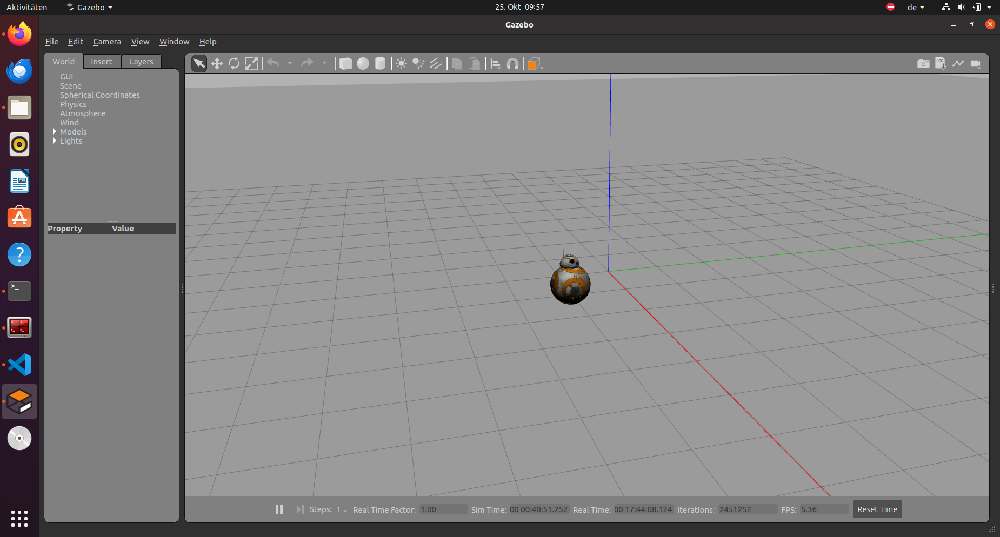
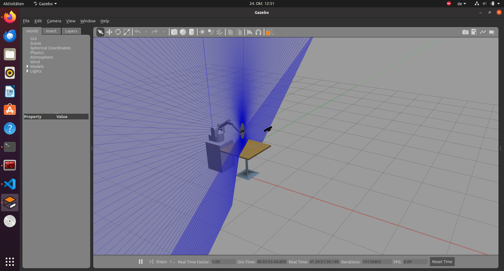
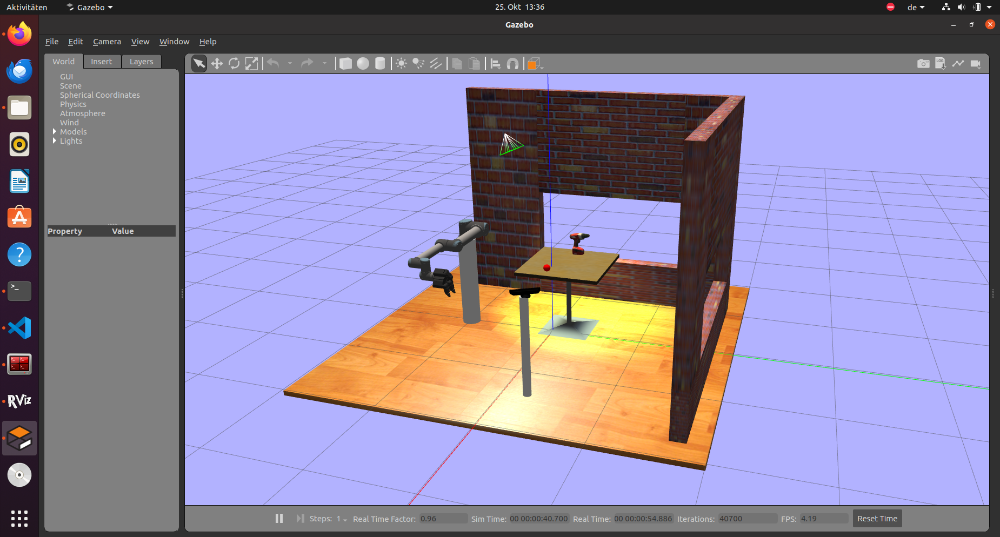

# ROS_Projects
roslaunch iri_wam_gazebo main.launch
roslaunch unit_5_services my_robot_arm_demo.launch
--------------------------------------------
roslaunch bb_8_gazebo main.launch
roslaunch unit_5_services start_bb8_move_in_circle_service_server.launch 
roslaunch unit_5_services call_bb8_move_in_circle_service_server.launch 
--------------------------------------------
#### Custom Server message:
roslaunch bb_8_gazebo main.launch
roslaunch unit_5_services start_bb8_move_custom_service_server.launch
roslaunch unit_5_services call_bb8_move_custom_service_server.launch
--------------------------------------------
#### Create a python class
roslaunch bb_8_gazebo main.launch
rosrun unit_5_services bb8_move_circle_class.py
--------------------------------------------
#### Use Python class in Server and Client
roslaunch unit_5_services bb8_move_circle_service_server.launch 
rosservice call /move_bb8_in_circle "duration: 5"
--------------------------------------------
#### Actions and drone simulation
Gazebo:
roslaunch drone_construct main.launch
Action Client:
roslaunch ardrone_as action_server.launch
rosrun my_action_client_example_pkg ardrone_action_client.py
rosrun my_action_client_example_pkg move_drone.py
rosrun my_action_client_example_pkg cancel_goal_test.py
Action Server:
-------------------------------------
roslaunch model_gazebo main.launch

#### Source Gazebo simulations:
https://bitbucket.org/theconstructcore/spawn_robot_tools/src/master/

# Gazebo simulation:

